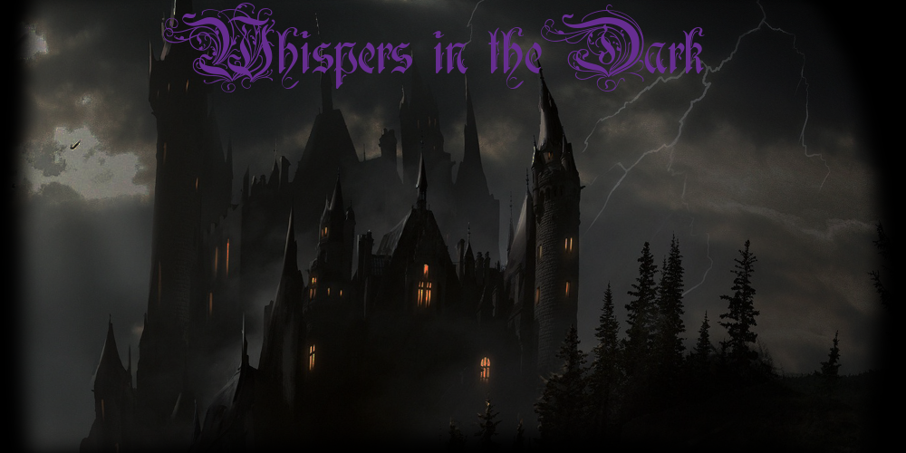
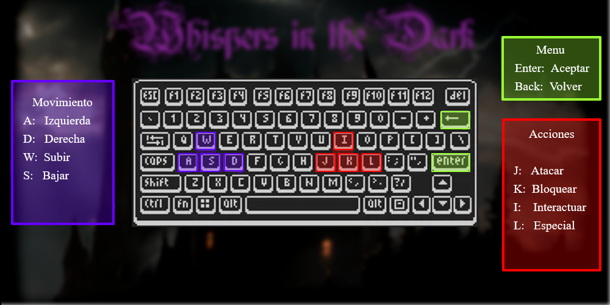

# Concurso Wollok Game 2021 - Presentacion de juego: Whispers in the Dark

 
# Introducción

Whisper in the Dark es un juego desarrollado en Wollok, utilizando las librerias que permiten el desarrollo de juegos, es un juego que formaria parte de lo que seria el genero de los Metroidvania. 

# Historia

En este juego manejamos a _NombrePendiente_, nuestro personaje principal, el cual se encuentra viviendo en los peores momentos de su vida,y del mundo, ya la que la corrupcion, una fuerza maligna que arrasa con todo a su paso, comenzó a expandirse y a corromper a toda criatura con la que se encontrase, provocando que dichas criaturas corrompidas, se agrupen en un castillo colosal, del cual, como si de un nido se tratase, salen a buscar comida para alimentar a sus ordas de criaturas corrompidas, de todo tipo, desde lobos y orcos, hasta fantasmas e incluso demonios y angeles. Es en estas circunstancias donde el pueblo de nuestro protagonista(uno de los ultimos que quedaban en pie) es arrasado y la familia de este es secuestrada y llevada al castillo como alimento, nuestro protagonista deberá ir a rescatarlos cuanto antes y poder salir con vida de ahi junto a su familia, siempre y cuando no caiga en la locura y se corrompa como todos los demas.

# Controles/Reglas del juego

Para mover al personaje utilizamos las teclas:
- _Tecla W:_ El personaje sube una escalera, o se desplaza hacia otra zona.
- _Tecla S:_ El personaje baja una escalera, o se desplaza hacia otra zona.
- _Tecla A:_ El personaje se mueve hacia la izquierda.
- _Tecla D:_ El personaje se mueve hacia la derecha.

Para realizar las acciones con nuestro personaje:

- _Tecla J:_ El personaje ataca.
- _Tecla I:_ El personaje interactúa con el/los objeto/s que se encuentra/n en su posición.
- _Tecla K:_ El personaje bloquea con su escudo.
- _Tecla L:_ El personaje realiza una accion especial (Aún no implementada).

Para recorrer los menus del juego:

- _Tecla ENTER:_ El personaje ataca.
- _Tecla BACKSPACE:_ El personaje interactúa con el objeto.

# Niveles
El juego está separado por niveles, a su vez, estos niveles contienen distintas "pantallas" en la cual el personaje debe ir recorriendo, como si de un laberinto se tratase,hasta llegar a la sala del jefe y/o encontrar algo que en especifico. La idea de esto, es poder expandir casi sin limites la creatividad y los niveles mediante el agregado de zonas nuevas que contengan niveles y sus pantallas correspondientes.

__Primer nivel:__ 
[Insertar imagen nivel]
//TODO: desarrollar

__Jefe:__
[Insertar imagen nivel]
//TODO: desarrollar

# Desarrolladores: 
- Desarrollador principal: Lo Surdo, Braian Gabriel
- Colaboradores: Lautaro Martin Villagra y Luciano Ruggeri

Todos estudiantes de programación de la misma comisión de Objetos I en la UNQ.

# Acerca de
Whispers in the Dark es un juego que fue desarrollado durante el primer cuatrimestre de 2020 por "Naughty Cerberus", nombre de grupo el cual fue elegido al comienzo para dar inicio al proyecto final de entrega necesario para aprobar la materia de Programacion Orientada a Objetos I de la Universidad Nacional de Quilmes. 
Inspirados en la idea de desarrollar un juego estilo Metroid-vania (Nombre dado a este tipo de juegos), nos pusimos a pensar como aplicar nuestros conocimientos sobre la programacion orientada a objetos recientemente adquiridas para poder desarrollar un juego de este tipo. Vimos el potencial que podia tener Wollok para el desarrollo de un juego de este estilo, por lo cual nos decidimos a encarar nuestro proyecto en base a esa idea. 
Tras la finalización de la cursada,nuestro grupo "Naughty Cerberus" abandonó el proyecto(Debido a que cumplió su objetivo de aprobacion como trabajo final para la materia), por lo cual todo el desarrollo posterior,correccion de errores,refactoring de código y postulación al concurso Wollok Gaming 2021 fue realizada por Braian Gabriel Lo Surdo, quien decidió continuar el proyecto por su cuenta, un poco más.

La idea final del proyecto, es que cualquiera pueda jugar,modificar y expandir el juego.